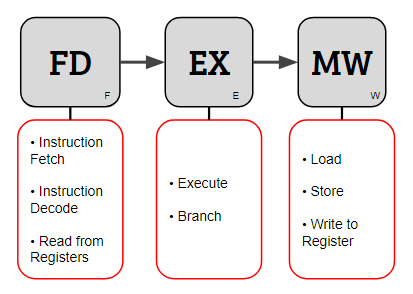
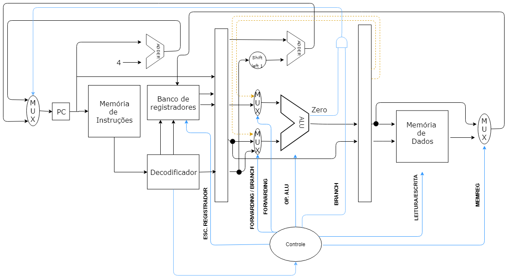

# FEWcore

FEWcore é um core RISC-V que segue as especificações RV32E com algumas leves modificações. Este projeto é o trabalho prático da disciplina Organizações de Computadores 2 no semestre 2018/2 da UFMG.

## Diagrama de pipeline

## Caminho de dados

